<div align=center>
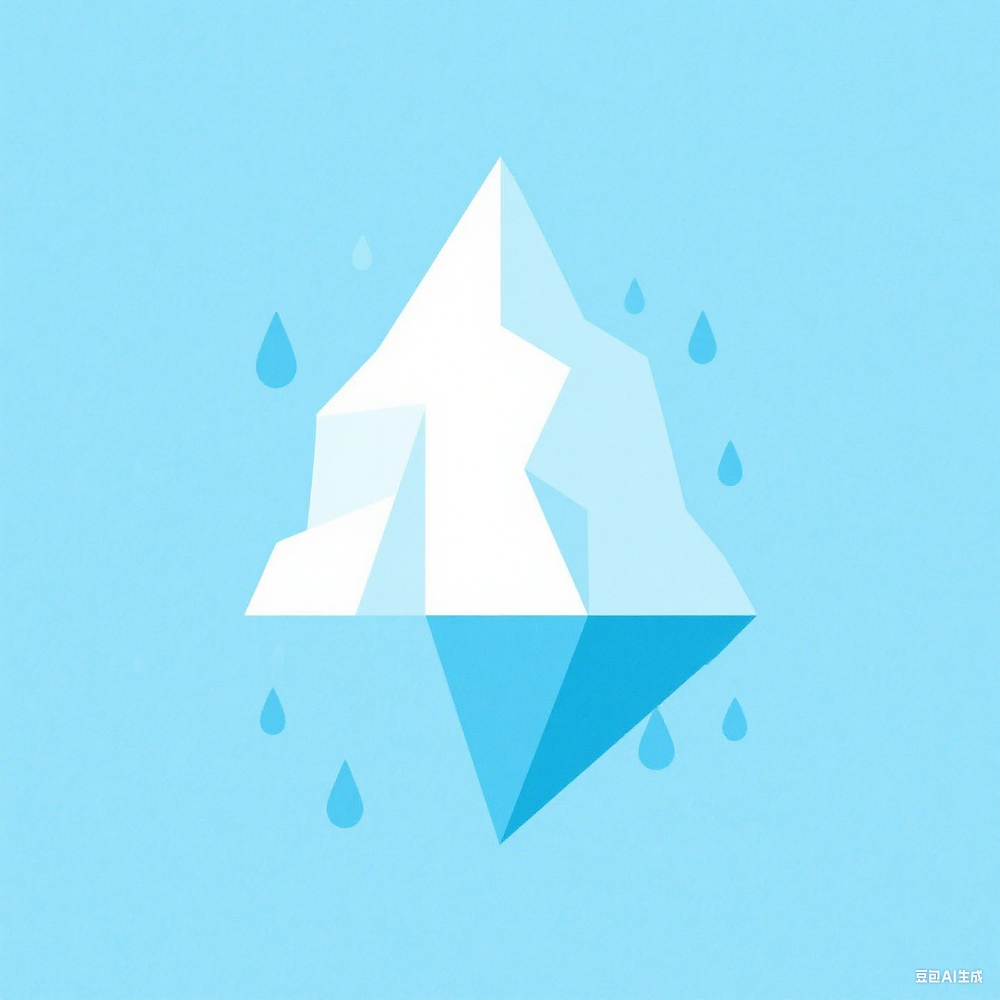
</div>

<h1 align="center">Reveal Hidden Pitfalls and Navigate Next Generation of Vector
Similarity Search with Task-Centric Benchmarks</h1>


## :link: Introduction
Iceberg is a comprehensive benchmark suite for end-to-end evaluation of VSS (Vector Similarity Search) methods in realistic application settings. It spans 7 diverse datasets across key domains including image classification, face recognition, text retrieval, and recommendation systems. Each dataset contains 1M to 100M vectors enriched with task-specific labels and metrics, enabling evaluation of retrieval algorithms within full application pipelines—not just in isolated recall-speed scenarios. Iceberg benchmarks 13 state-of-the-art VSS algorithms and re-ranks them using task-centric performance metrics, uncovering substantial deviations from conventional recall/speed-based rankings. Morever, Iceberg propose an interpretable decision tree to guide practitioners in selecting and tuning VSS methods for specific workloads.

<div align=center>
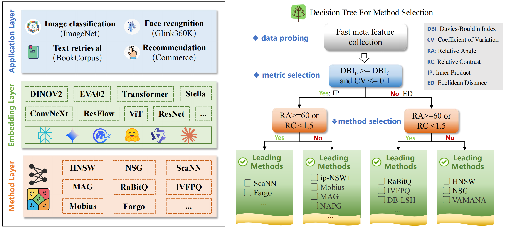
</div>

## :books: Datasets
> The dataset was not uploaded during the review period, but we are committed to releasing and maintaining it publicly on open-source platforms such as Hugging Face in the final version.
### Overview
| Dataset           | Base Size  | Dim  | Query Size | Domain               | Origin data source                                           |
| ----------------- | ---------- | ---- | ---------- | -------------------- | ------------------------------------------------------------ |
| ImageNet-DINOv2   | 1,281,167  | 768  | 50,000     | Image Classification | https://image-net.org/index.php                              |
| ImageNet-EVA02    | 1,281,167  | 1024 | 50,000     | Image Classification | https://image-net.org/index.php                              |
| ImageNet-ConvNeXt | 1,281,167  | 1536 | 50,000     | Image Classification | https://image-net.org/index.php                              |
| Glink360K-IR101   | 17,091,649 | 512  | 20,000     | Face Recognition     | https://github.com/deepinsight/insightface/tree/master/recognition/partial_fc#glint360k |
| Glink360K-ViT     | 17,091,649 | 512  | 20,000     | Face Recognition     | https://github.com/deepinsight/insightface/tree/master/recognition/partial_fc#glint360k |
| BookCorpus        | 9,250,529  | 1024 | 10,000     | Text Retrieval       | https://huggingface.co/datasets/bookcorpus/bookcorpus        |
| Commerce          | 99,085,171 | 48   | 64,111     | Recommendation       |                                                              |
| AG-News           | 127,600    | 3072 | 3000       | Anomaly Detection    |                                                              |

### Detailed Description
#### D1: ImageNet 

ImageNet is a large-scale dataset containing millions of high-resolution images spanning thousands of object categories. Each image is annotated with ground-truth labels, either manually or semi-automatically. The dataset has been widely used in the computer vision community for model training and benchmarking, particularly for image classification tasks. 

**Emebedding Models:**

- DINOv2: https://huggingface.co/facebook/dinov2-base
- EVA02: https://huggingface.co/timm/eva02_large_patch14_448.mim_m38m_ft_in22k_in1k
- ConvNeXt: https://huggingface.co/timm/convnext_large_mlp.clip_laion2b_soup_ft_in12k_in1k_384

**End Tasks:**
- Label Recall@K: It measures how many correct task-specific labels appear in the top-K retrieved results. 

#### D2: Glink360K

Glint360K is a large-scale face dataset created by merging and cleaning multiple public face datasets to significantly expand both the number of identities and facial images.

**Emebedding Models:**

- Resnet-IR101: https://huggingface.co/minchul/cvlface_arcface_ir101_webface4m
- ViT: https://huggingface.co/gaunernst/vit_tiny_patch8_112.arcface_ms1mv3

**End Tasks:**
- Label Recall@K: It measures how many correct task-specific labels appear in the top-K retrieved results. 

#### D3: BookCorpus

BookCorpus consists of text extracted from approximately 19,000 books spanning various domains and has been curated into a high-quality corpus. The text was segmented at the paragraph level, with each paragraph concatenated into chunks containing eight sentences. This preprocessing resulted in a base dataset of 9,250,529 paragraphs. From this corpus, 10,000 paragraphs were randomly sampled to construct the query set. The unique ID of each paragraph was used as the label for its corresponding embedding vector.

**Emebedding Models:**

- Stella: https://huggingface.co/NovaSearch/stella\_en\_1.5B\_v5

**End Tasks:**
- Hit@K: It measures whether the most semantic relevant paragraph is included in the top-K retrieved results.


#### D4: Commerce

Commerce dataset, derived from anonymized traffic logs of a major e-commerce platform, serves as a representative benchmark for large-scale E-commerce systems. Collected over several months, the dataset comprises 99,085,171 records of frequently purchased grocery items. In addition, a query set of 64,111 entries was constructed to represent user profiles and associated search keywords. Each query is linked to a sequence of high-popularity items, enabling evaluation on downstream recommendation tasks. Item IDs are used as labels throughout the dataset.

**Emebedding Models:**

- ResFlow: https://github.com/FuCongResearchSquad/ResFlow

**End Tasks:** 
- Matching Score@K:  It measures whether the vectors retrieved by a query are both relevant and popular, as well as the cumulative popularity of those items.

#### D5: AG-News

NLP Anomaly Detection (NLP-AD) aims to identify text instances that deviate from normal linguistic patterns by using text embeddings and vector similarity search. Unlike structured data, text data is inherently unstructured, high-dimensional,and deeply influenced by the nuances of human language. We use the AG-News dataset, originally designed for news topic classification, which contains 127,600 samples across four classes: World, Sports, Business, and Sci/Tech. Texts from the description column are used as inputs for this task, with the World category designated and downsampled as the anomaly class. We form a 1:1 query set by pairing all anomaly samples with an equal number of normal samples, while the remaining normal texts serve as the base set.

**Emebedding Models:**

- OPENAI-text-3-large

**End Tasks:** 

We assign binary labels to indicate whether each text instance represents an anomaly, with anomalous samples labeled as 1 and normal samples as 0. This task adopts a kNN-distance anomaly detection criterion: for each query, the mean distance to its top-k retrieved vectors is computed and compared against a threshold derived from normal samples in the base set; samples exceeding the threshold are classified as anomalies. The downstream evaluation metric is the detection hit rate@K, defined as the proportion of anomalies correctly identified.

## :bookmark_tabs: Supported Algorithms

|         | Metric             | Type           | Original Code Link                                           |
| ------- | ------------------ | -------------- | ------------------------------------------------------------ |
| Fargo   | Inner Product      | Parition-based | https://github.com/Jacyhust/FARGO_VLDB23                     |
| ScaNN   | Inner Product      | Parition-based | https://github.com/google-research/google-research/tree/master/scann |
| ip-NSW  | Inner Product      | Graph-based    | https://github.com/stanis-morozov/ip-nsw                     |
| ip-NSW+ | Inner Product      | Graph-based    | https://github.com/jerry-liujie/ip-nsw/tree/GraphMIPS        |
| Mobius  | Inner Product      | Graph-based    | Our own implementation                                       |
| NAPG    | Inner Product      | Graph-based    | Our own implementation                                       |
| MAG     | Inner Product      | Graph-based    | https://github.com/ZJU-DAILY/MAG                             |
| RaBitQ  | Euclidean Distance | Parition-based | https://github.com/VectorDB-NTU/RaBitQ-Library               |
| IVFPQ   | Euclidean Distance | Parition-based | https://github.com/facebookresearch/faiss                    |
| DB-LSH  | Euclidean Distance | Parition-based | https://github.com/Jacyhust/DB-LSH                           |
| HNSW    | Euclidean Distance | Graph-based    | https://github.com/nmslib/hnswlib                            |
| NSG     | Euclidean Distance | Graph-based    | https://github.com/ZJULearning/nsg                           |
| Vamana  | Euclidean Distance | Graph-based    | https://github.com/microsoft/DiskANN                         |


## :rocket: Installation & Quick Start

### Clone the repository

```bash
git clone project
```
### Environment Requirements

```bash
GCC 4.9+ with OpenMP; Python 3.10+; CMake 2.8+; Boost 1.55+; MKL; ScaNN; Faiss
```
### Build the project

```bash
cd project
mkdir build && cd build
cmake .. 
make -j8
```

### Run the benchmark
**Example**: We use HNSW for the ImageNet dataset as an example to run the benchmark (./scripts/run_hnsw.sh).

- **Configure the dataset**:

  ```shell
  dataset_imagenet1k_avg() {
    BASE_PATH="/path/to/your/dataset_root/data-base.bin"
    QUERY_FILE="/path/to/your/dataset_root/data-query.bin"
    PREFIX="data"
    K=100
    DATA_DIM=1536
    DATASET_TYPE="dataset_root"
    DATA_PRE_PATH="/path/to/your/dataset_root"
    TRAIN_NAME="data-base"
    TEST_NAME="data-query"
    data_num=1281167
    query_num=50000
  }
  ```

- **Configure the algorithm** (scritps/run_hnsw.sh)

  ```shell
  - pre_path: "${PROJECT_ROOT}/YOUR_STORED_INDEX_PATH"
  - algorithm: "Algorithm Name"
  - mode: "build/search"
  - efc: "build parameter for HNSW"
  - M: "build parameter for HNSW"
  - efs: "search parameter for HNSW"
  - type: "NN/IP"
  - INDEX_PREFIX_PATH: "${pre_path}/${algorithm}/${PREFIX}_M${M}_L${efc}.index"
  - RESULT_PREFIX_PATH: "${pre_path}/${algorithm}/${PREFIX}_M${M}_L${efc}.result"
  - log_file: "${pre_path}/${algorithm}/${PREFIX}_M${M}_L${efc}.log"
  - recall_path: "${PROJECT_ROOT}/tools/recall_${DATASET_TYPE}.py"
  - result_name: "${PREFIX}_M${M}_L${efc}"
  ```

  

- **run the algorithm & evaluation**

  ```shell
  case "$mode" in
    build)
      echo "Building index..."
      ./test/benchmark_hnsw ${BASE_PATH} ${QUERY_FILE} ${mode} $DATA_DIM $K ${efc} ${M} ${INDEX_PREFIX_PATH} ${RESULT_PREFIX_PATH}  | tee -a "$log_file"
      ;;
    search)
      echo "Searching index..."
      for ef_search in "${efs[@]}"; do
        echo "Running with efs: $ef_search" | tee -a "$log_file"
        ./test/benchmark_hnsw ${BASE_PATH} ${QUERY_FILE} ${mode} ${DATA_DIM} ${K} ${efc} ${M} ${INDEX_PREFIX_PATH} ${RESULT_PREFIX_PATH} ${ef_search} | tee -a "$log_file"
        python3 ${recall_path} ${DATA_PRE_PATH} ${PREFIX} ${TRAIN_NAME} ${TEST_NAME} ${algorithm} ${K} ${type} ${result_name} ${pre_path}| tee -a "$log_file"
      done
      ;;
    *)
      echo "Invalid mode. Use 'build' or 'search'."
      exit 1
      ;;
  esac
  ```

### To-Do Lists
- ✅ Open-source code is available for the benchmarks.
- 🔄 Docker Environment.
- 🔄 More real-worlds tasks, advanced embedding models, and new algorithms.
- 🔄 Visualization Interface.

## :bookmark_tabs: Pipeline
<h3 align="center">Dataset Selection -- Embedding Generation -- Benchmark Evaluationn</h3>
<div align=center>
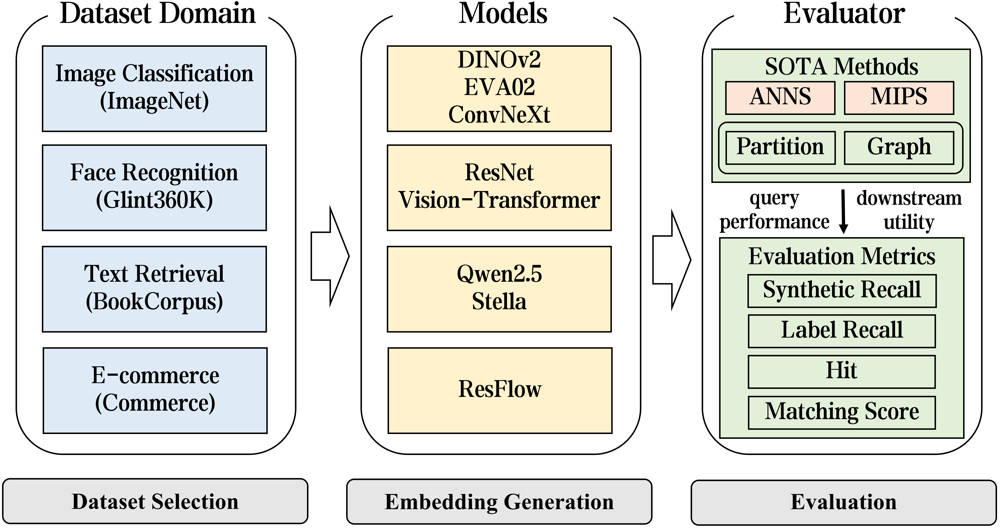
</div>

## :pencil:  Results  

### Iceberg LeaderBoard 1.0
<div align=center>
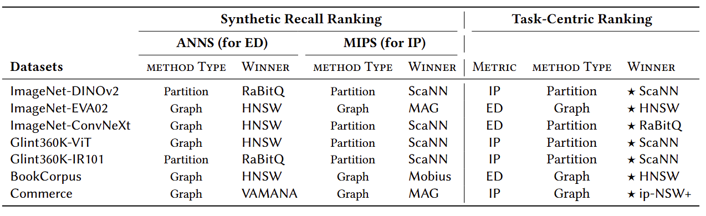
</div>

### Task-centric performance versus two similarity metrics

<div align=center>
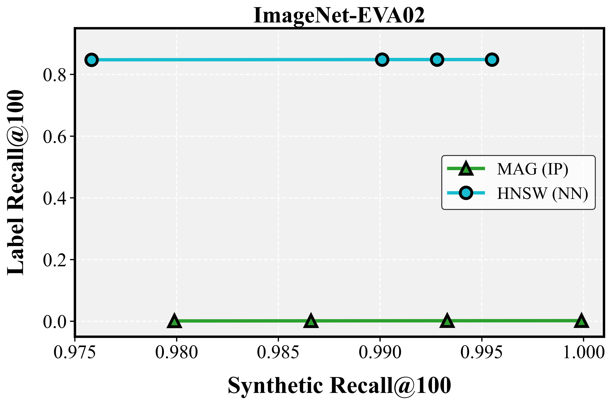
</div>

<div align=center>
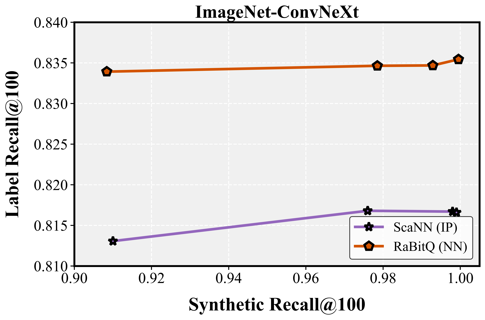
</div>

<div align=center>
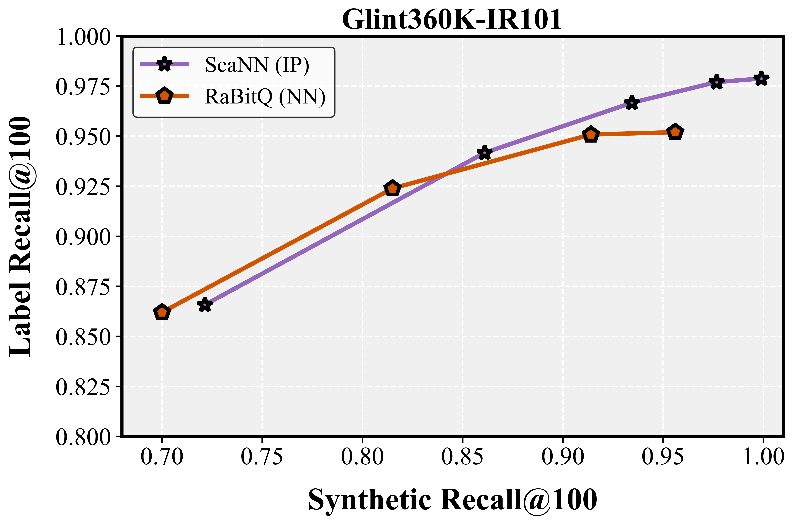
</div>

<div align=center>
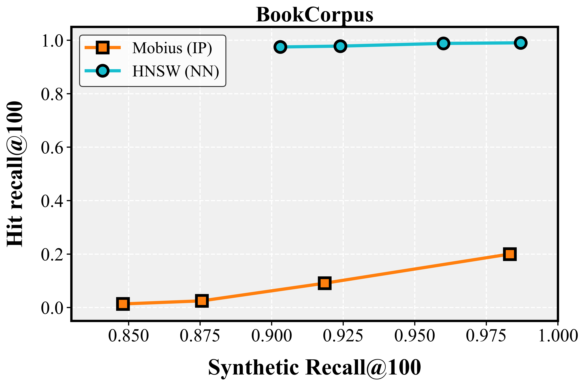
</div>


### Query Performance on Synthetic Recall@100

<div align=center>
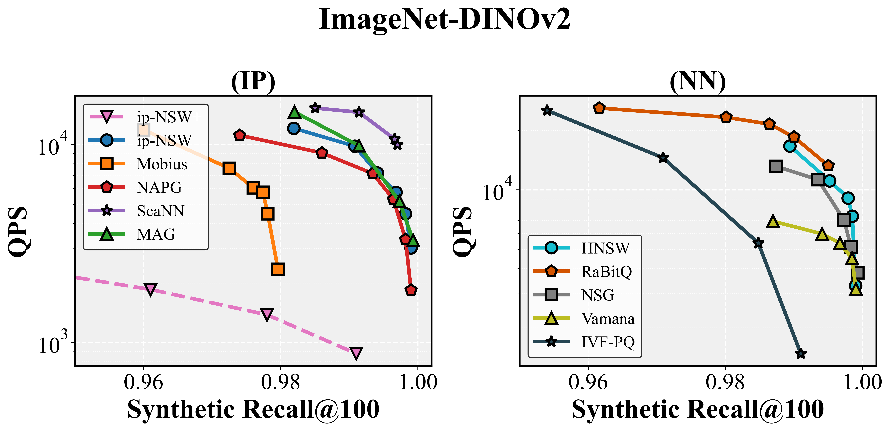
</div>

<div align=center>
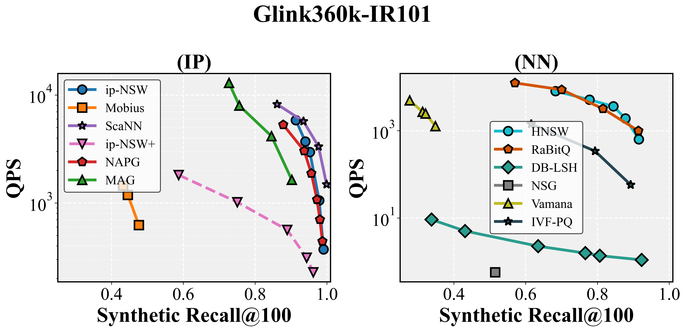
</div>

<div align=center>

</div>

<div align=center>
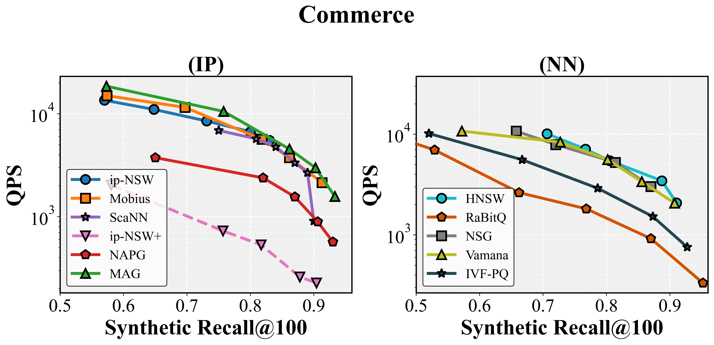
</div>


